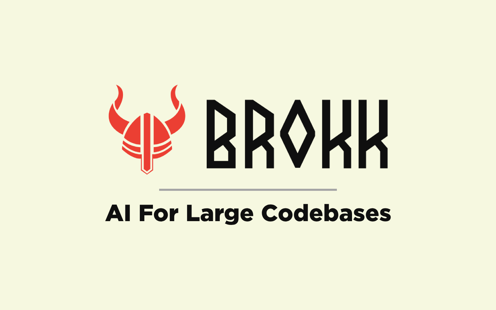

<p align="center">
  
</p>

# Overview

Brokk (the [Norse god of the forge](https://en.wikipedia.org/wiki/Brokkr))
is the first code assistant that understands code semantically, not just
as chunks of text.  Brokk is designed to allow LLMs to work effectively
on large codebases that cannot be jammed entirely into working context.

There is a [Brokk Discord](https://discord.gg/QjhQDK8kAj) for questions and suggestions.

# Documentation

Brokk documentation is at https://brokk.ai/documentation/.

# Contributing

Brokk uses sbt (Scala Build Tool) since it has a Scala component. To build Brokk,
1. Install sbt (e.g. with sdkman)
2. Run the sbt repl: `sbt` (with JDK 21 or newer)
3. In the sbt repl, run individual commands: `run`, `clean`, `test`, `assembly`, etc.

If you have `sbtn` installed it can be used to run commands such as `sbtn run` with a faster startup time.
(You can also run a single command without the repl with e.g. `sbt run` but sbt has a very high
startup overhead so using the repl or `sbtn` is recommended.)

### Checking the PATH Brokk Sees

To debug PATH issues, inspect the environment from the shell Brokk uses.

- **On Linux/macOS (`/bin/sh`)**
  ```bash
  /bin/sh -c env
  ```

- **On Windows (`cmd`)**
  ```cmd
  cmd /C set
  ```

> If you're using WSL or Git Bash on Windows, you may still be using a Unix-like shell, and `/bin/sh -c env` would apply.

If `sbt` does not appear in the output of these commands, Brokk won't be able to find it during execution.

We recommend using the [official sbt installer](https://www.scala-sbt.org/download.html), as it configures the PATH correctly on most systems.

There are documents on specific aspects of the code in [src/main](https://github.com/BrokkAi/brokk/tree/master/src/main).

## Icon Browser

To explore available Look and Feel icons for UI development:
- GUI browser: `sbt "runMain io.github.jbellis.brokk.gui.SwingIconUtil icons"`
- Console list: `sbt "runMain io.github.jbellis.brokk.gui.SwingIconUtil"`

Use `SwingUtil.uiIcon("IconName")` to safely load icons with automatic fallbacks.
